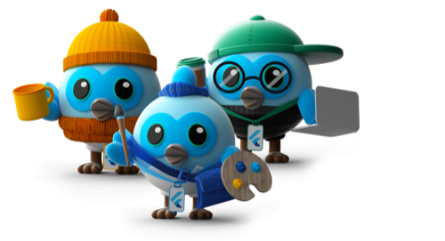

# Dashatar Flutter 

[](https://flutter.dev)
[](https://pub.dev/packages/dashatar_flutter)
[](https://pub.dev/packages/dashatar_flutter/score)
[](https://pub.dev/documentation/dashatar_flutter)
[](https://intuosol.github.io/dashatar_flutter/)
[](https://github.com/intuosol/dashatar_flutter/commits/main)
[](https://intuosol.com)

A Flutter package that provides an API for using Dash avatars ([Dashatars](https://github.com/PersianFlutter/dashatars)) in Flutter projects.

Try it out in the [demo app](https://intuosol.github.io/dashatar_flutter/).



## Features

- Generate Dash avatars (Dashatars)
- Choose from different dashatar types (Silhouette, Basic, Designer, Developer, Manager)
- Use random or specific dashatar variants
- Customize size and background color
- Simple and flexible API

## Usage

### Basic Usage

```dart
import 'package:dashatar_flutter/dashatar_flutter.dart';

// Basic usage - create a Developer dashatar
Dashatar(
  index: 5, // Variant index (0-48)
  type: DashatarType.developer,
)

// Create a random dashatar
Dashatar.random()

// Create a basic dashatar
Dashatar.basic()

// Create a silhouette
Dashatar.silhouette()
```

### Customization

```dart
// Custom size and background color
Dashatar(
  index: 12,
  type: DashatarType.manager,
  size: 100,
  backgroundColor: Colors.blue.shade100,
)
```

## Attribution

The dashatar images were originally created by the Persian Flutter community:

- Repository: https://github.com/PersianFlutter/dashatars
